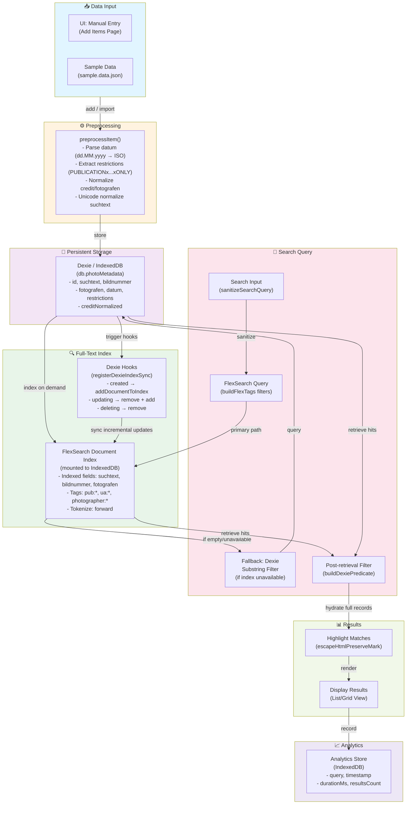

# Browser Search Tool

Live demo: https://avimehenwal.github.io/browser-search-tool/

A small, client-side search application demonstrating:

- Full-text search with FlexSearch
- Persistent metadata store with IndexedDB
- Incremental indexing and paginated results
- Accessible, responsive UI built with shadcn/@base-ui + Tailwind CSS

## Quick start

Prerequisites:

- Node.js (18+ recommended)
- npm

Install and run the dev server:

```bash
npm install
npm run dev
```

then open http://localhost:3000/browser-search-tool/

Build, export (static) and serve:

```bash
npm install
npm run build
npm run start
# static site served at http://localhost:3000/browser-search-tool/ (uses python3 http.server)
```

## Tech stack

- Next.js 16 (app router)
- React 19 + TypeScript
- Tailwind CSS + shadcn components
- @base-ui/react primitives for accessible UI
- FlexSearch for in-memory full-text search
- Dexie / dexie-react-hooks for IndexedDB persistence
- Zustand for lightweight state
- date-fns, Hugeicons for icons

## Features & patterns

- Client-side search layer that mirrors a REST contract (GET /api/search).
- Full-text ranking (primary `suchtext`, secondary `fotografen`, tertiary
  `bildnummer`) via FlexSearch.
- Persistent dataset stored in IndexedDB with incremental `addDocumentToIndex()`
  support.
- Filtered searches (credit, date range, restriction codes, archive ids) and
  server-like pagination.
- Highlighting of matched terms in results (HTML `<mark>` snippets).
- Modular API surface in `src/lib/api` so the same calls work client-side or
  server-side.
- Reusable, accessible UI primitives in `src/components/ui/` (Label, Combobox,
  Sheet, etc.).

## The `/api/search` contract (summary)

This project implements a client-side function `searchAPI(req)` that exactly
mirrors:
`GET /api/search?q=...&credit=...&dateFrom=...&dateTo=...&restrictions=...&sort=...&page=1&pageSize=10`

Key request fields (see `src/lib/api/types.ts`):

- `q` — full-text query
- `credit` — filter by credit/fotografen
- `dateFrom` / `dateTo` — yyyy-MM-dd
- `restrictions` — array of publication restriction codes
- `archive_id` — array of archive ids
- `sort`, `page`, `pageSize`

Example client usage (client-side implementation):

```ts
import { searchAPI } from "@/lib/api";
const resp = await searchAPI({ q: "jackson", page: 1, pageSize: 10 });
console.log(resp.items, resp.total, resp.durationMs);
```

```ts
// app/api/search/route.ts
import { NextResponse } from "next/server";
import { searchAPI } from "@/lib/api";

export async function GET(req: Request) {
  const url = new URL(req.url);
  const params = url.searchParams;
  const response = await searchAPI({
    q: params.get("q") ?? "",
    credit: params.get("credit") ?? undefined,
    dateFrom: params.get("dateFrom") ?? undefined,
    dateTo: params.get("dateTo") ?? undefined,
    restrictions: params.getAll("restrictions") || undefined,
    page: Number(params.get("page") ?? 1),
    pageSize: Number(params.get("pageSize") ?? 10),
  });
  return NextResponse.json(response);
}
```

The types for requests/responses live in `src/lib/api/types.ts`.

## Mobile & accessibility

- Responsive UI: layout and components use Tailwind responsive utilities and
  mobile-first patterns (e.g. `Sheet` for small-screen drawers).
- Accessibility: UI primitives use semantic HTML, labelled inputs, `sr-only`
  labels, and ARIA-friendly primitives from `@base-ui/react` (see components in
  `src/components/ui/`).
- Keyboard and screen-reader interactions are supported by the underlying
  primitives (`Combobox`, `Dialog/Sheet`, labeled inputs, etc.).

## Where to look in the code

- API surface: `src/lib/api` (`index.ts`, `types.ts`, `searchEngine.ts`)
- Search index & helpers: `src/lib/index.repo.ts`, `src/lib/flexIndex.ts`
- UI components: `src/components/*` and `src/components/ui/*`
- IndexedDB store: `src/lib/db.ts`, `src/lib/dbInit.ts`

### Architecture Diagram



### High-level approach

- Client-first: Dexie / IndexedDB (`src/lib/db.ts`) is the canonical store and a
  FlexSearch Document index (mounted to IndexedDB) provides fast full-text
  search and highlights (`src/lib/flexIndex.ts`).
- Preprocess on ingest: `preprocessItem()` normalises `suchtext`, parses dates
  to ISO, extracts restriction codes and normalises credits so filters can be
  exact and efficient (`src/lib/api/preprocessor.ts`).
- Indexing: bulk builds (`buildIndexFromIndexedDB`) and incremental updates via
  Dexie hooks (`registerDexieIndexSync`) call `addDocumentToIndex()` to keep the
  index in sync with the DB (`src/lib/indexSync.ts`).

### Assumptions

- Data is semi-structured: `suchtext` may contain embedded metadata (e.g.
  `PUBLICATIONx...xONLY`).
- Typical deployment is small-to-medium datasets where a browser-mounted index
  provides good UX and offline capability.
- The browser environment has IndexedDB available and users tolerate local
  storage limits.

### Design decisions (search & relevance)

- Engine: FlexSearch Document index with `tokenize: "forward"` to prioritise
  prefix/suggestion-style interactions and low-latency typing experiences.
- Tagging: index-time tokens like `pub:`, `ua:`, `photographer:` support fast
  exact filtering (`src/lib/filterAdapter.ts`).
- Scoring: the code relies on FlexSearch's internal ranking with
  `suggest: true`. No field-weighted or recency-based scoring is currently
  applied; relevance is primarily FlexSearch-driven. To alter ranking, add field
  weights or apply a post-ranking step.
- Fallback & correctness: if FlexSearch is unavailable or empty, the repo
  performs a Dexie-based substring filter for availability; complex filters are
  validated via `buildDexiePredicate` after retrieval to guarantee correctness
  (`src/lib/index.repo.ts`).

### Limitations & what I would do next

- Limitations:
  - An in-browser FlexSearch index will become memory/CPU bound at very large
    scales (millions of documents).
  - Regex-based metadata extraction is pragmatic but brittle compared to
    structured upstream metadata.
  - No advanced ranking (recency boosts, personalization, multi-field weighting)
    is implemented today.

- Next steps / recommendations:
  1. For large-scale production, migrate search to a server-side engine
     (Typesense/Meilisearch/Elasticsearch/OpenSearch) and reuse
     `preprocessItem()` in the ingestion pipeline.
  2. Add field-level weights and recency/boosting rules for refined relevance,
     plus telemetry to measure ranking quality.
  3. Add unit and integration tests for `preprocessItem`, `buildDexiePredicate`,
     index build flows, and the Dexie hooks to prevent regressions.
  4. Add monitoring around index build durations, worker failures, and ingestion
     lag; switch to an idempotent queue for reliable ingestion.

Key files: [src/lib/api/preprocessor.ts](src/lib/api/preprocessor.ts),
[src/lib/db.ts](src/lib/db.ts), [src/lib/flexIndex.ts](src/lib/flexIndex.ts),
[src/lib/indexSync.ts](src/lib/indexSync.ts),
[src/lib/index.repo.ts](src/lib/index.repo.ts)
